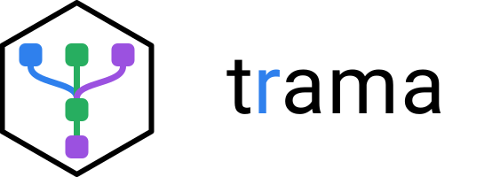

# trama <picture><source media="(prefers-color-scheme: dark)" srcset="man/figures/logo-dark.svg"></picture>

O pacote trama é uma ferramenta em R pra construir fluxos lógicos com
visualização interativa. Tem coleções prontas pra fluxos comuns e é
extensível pra blocos novos, escritos em R base ou pacotes terceiros.

> **In English.** trama is an R package for building computation graphs in an
> interactive node editor (Shiny + React). Every node renders its own result —
> a table, a plot, a model summary — right on the canvas, and editing a
> parameter recomputes only what depends on it (content-addressed, incremental,
> pull-based execution). Flows are plain JSON and can also be written in R.
> Domain logic lives in installable collections: data wrangling, plots, time
> series, statistical models, multivariate analysis and survey sampling.
> Documentation is in Portuguese; installation is below.

## Instalação

Requer R ≥ 4.1. Enquanto o pacote não está no CRAN, instale do GitHub com
[pak](https://pak.r-lib.org):

```r
install.packages("pak")

# núcleo + coleções de dados e gráficos (o ponto de partida recomendado)
pak::pak(c(
  "uaipedro/trama",
  "uaipedro/trama/collections/trama.data",
  "uaipedro/trama/collections/trama.view"
))
```

As outras coleções são opcionais — instale só as que for usar. Cada uma puxa
as dependências (inclusive `trama.data`/`trama.view`) sozinha:

```r
pak::pak("uaipedro/trama/collections/trama.series")    # séries temporais
pak::pak("uaipedro/trama/collections/trama.models")    # modelos estatísticos
pak::pak("uaipedro/trama/collections/trama.multi")     # análise multivariada
pak::pak("uaipedro/trama/collections/trama.sampling")  # amostragem
```

Para fixar uma versão, acrescente a tag: `"uaipedro/trama@v0.1.0"`.

Com `remotes`, instale na ordem das dependências — núcleo, `trama.data`,
`trama.view` e só então as demais:

```r
remotes::install_github("uaipedro/trama")
remotes::install_github("uaipedro/trama", subdir = "collections/trama.data")
remotes::install_github("uaipedro/trama", subdir = "collections/trama.view")
```

## Primeiro fluxo

```r
library(trama)

# cria a pasta do projeto se ela não existir e abre o editor
tr_app(tr_project("meu-projeto", collections = c("trama.data", "trama.view")))
```

O editor abre no navegador. Arraste blocos da paleta (por exemplo, *dados de
exemplo* → *filtrar* → um gráfico), ligue as portas e edite parâmetros: cada
card mostra o próprio resultado. O fluxo é salvo em `meu-projeto/flows/main.json`.

## Conceitos

O fluxo é um documento que organiza funções em um diagrama de blocos
conectados, exibindo o resultado de cada etapa. Alterar um parâmetro,
adicionar um bloco novo ou uma nova conexão recalcula apenas os blocos
afetados por essa mudança.

Os blocos vêm agrupados em coleções — pacotes R que registram um conjunto de
tipos, blocos e a forma de exibir cada resultado. Um bloco novo é uma função
R comum, declarada com as próprias entradas, saídas e parâmetros.

Cada bloco declara portas de entrada e saída, configuráveis com tipo,
obrigatoriedade e multiplicidade. As portas de saída de um bloco se conectam
às entradas dos seguintes.

## Para quê

Enxergar, editar, produzir e analisar fluxos lógicos de funções e
transformações — com uma coleção ampla, mas não exaustiva, de peças prontas, e
com o custo de acrescentar as que faltam mantido baixo.

O que distingue: você não vê um diagrama do que o código *faria*, vê o dado
que ele **produziu**, em cada etapa. E mudar um parâmetro recomputa só o que
depende dele.

O [manifesto](docs/manifesto.md) tem o objetivo completo, o horizonte de longo
prazo e os não-objetivos.

## Como funciona

```
comando → documento → plano (hash por nó) → fila → workers
                                                     ↓
                                store: <hash>.artefato + <hash>.preview
                                                     ↓
                                              eventos → front
```

O **store endereçado por conteúdo é o protocolo**, não um cache. O worker
computa, grava artefato e preview sob a chave, e devolve só o handle —
nenhum valor pesado atravessa fronteira de processo. É isso que permite rodar
as funções pesadas fora do processo da interface sem serializar objeto vivo.

Cinco contratos no núcleo — tipo, catálogo, documento, execução, renderização.
Tudo que não é um deles é coleção.

## Escrever o fluxo em R

O documento é o mesmo, visto pela interface ou pelo console: montar na tela
arrastando blocos produz o JSON; `tr_flow()`/`tr_add()`/`tr_link()` produzem o
idêntico JSON escrevendo R. `tr_flow_code()` faz o caminho de volta — o ETL de
`exemplos/vendas` vira:

```r
tr_flow(reg) |>
  tr_add("ler", "data/read_csv", path = "vendas.csv") |>
  tr_add("filtrar", "data/filter", expr = "valor > 180", from = "ler") |>
  tr_add("total", "data/mutate", name = "receita", expr = "valor * qtd", from = "filtrar") |>
  tr_add("porregiao", "data/group_summarise", by = "regiao", name = "receita_total", expr = "sum(receita)", from = "total") |>
  tr_add("porproduto", "data/group_summarise", by = "produto", name = "receita_total", expr = "sum(receita)", from = "total") |>
  tr_add("ranking", "data/arrange", cols = "receita_total", desc = TRUE, from = "porregiao")
```

`from` liga a primeira saída à primeira entrada obrigatória livre e
compatível — o caso comum de "encadeia". `tr_link()` fica para ligações que
não são a canônica, e `tr_set()` para editar parâmetro depois de montado — e
também para preencher param cujo nome colide com um argumento do próprio
`tr_add()` (`flow`, `id`, `type`, `from`, `label`, `seed`, `position`), que ali iria
para o argumento da DSL. Nos quatro primeiros isso é recusado com erro, nunca
aceito em silêncio.

## Domínio nenhum mora no núcleo

Uma coleção é um pacote R que registra tipos, categorias, blocos, renderizadores
de preview, editores de parâmetro e fluxos de exemplo. Sem bundler e sem
toolchain: R comum mais um `.js` solto (e, se quiser, um `.css`).

```r
tr_node("data/filter", fn = nd_filter, label = "Filtrar",
  description = "Mantém as linhas em que a condição é verdadeira.",
  help    = "## Descrição\n\nCondição em branco é nó desligado…",  # markdown
  inputs  = list(data = "data/table"),
  outputs = list(out  = "data/table"),
  params  = list(expr = tr_param("expr", "", label = "Condição",
                                 example = "valor > 100")))
```

`description` é **obrigatória** — bloco sem uma linha dizendo o que faz não
compila, e é essa régua que faz coleção nova nascer documentada. `help` é
markdown e vira o painel lateral de ajuda; `example` num param vira o
placeholder do campo. O catálogo já era legível por máquina; agora ele carrega
também para que serve cada bloco e o que se digita em cada campo, que é a metade
que faltava para a tese "AI-friendly" do [manifesto](docs/manifesto.md).

```js
import { registerRenderer, registerWidget } from "trama";
registerRenderer("data/table", MinhaTabela);            // uma vista
registerRenderer("data/table", { views: [               // ou várias
  { id: "tabela",  label: "tabela",  component: MinhaTabela },
  { id: "colunas", label: "colunas", component: MinhasColunas },
]});
```

Um renderer é um conjunto de vistas do mesmo artefato, alternáveis numa faixa de
abas no card — é o que evita plantar um bloco extra só pra olhar o mesmo dado de
outro jeito. Cada vista recebe `{artifact, handle, assetUrl}`. Todo tipo que
declare `summary=` no `tr_type()` ganha uma vista `resumo` sem pedir.

`trama.data` (em `collections/`) é a coleção de referência: 28 blocos em sete
categorias — fonte (CSV, RDS, Parquet, Excel, dados de exemplo, gerador), conhecer,
limpar, transformar, reformatar, agregar e gravar. Todo bloco tem ajuda; todo erro de usuário tem
classe (`tr_data_errors()`); a suíte é dela.

`trama.view` é a segunda: dezenove gráficos ggplot2 em três categorias
(relação, distribuição e comparação — do disperso ao violino, à acumulada, às
médias com intervalo de confiança, ao pareamento e ao Pareto), e
**nenhum JavaScript** — o `preview` do tipo `view/plot` grava um PNG e aponta
para o renderer `trama/image` do núcleo, que já sabe desenhar imagem e ampliar
no clique. Ela usa o tipo `data/table` da `trama.data`, então carrega depois
dela.

`trama.series` é a terceira, e a que prova que coleção se apoia em coleção:
séries temporais em 30 blocos — operadores (diferença, defasagem, Box-Cox,
janela, média móvel, agregação por calendário, interpolação), decomposição
clássica e STL, ARIMA, ETS e Holt-Winters com previsão, referências e
acurácia, testes (ADF, KPSS, Phillips-Perron, Ljung-Box) e os gráficos que só
existem para série (correlograma, PACF, sazonal, subséries, defasagens). Não
repete nada das outras duas: traz o tipo `series/ts` (a série carrega a
frequência) com **adaptadores** para `data/table`, de modo que uma série ligada
num `data/filter` ou num `view/histogram` vira tabela na aresta, sem bloco no
meio; e os gráficos saem no tipo `view/plot`, pela costura que a `view` exporta
(`tr_view_props()`, `tr_view_finish()`, `tr_view_render()`). Carrega depois
das duas.

## Estado

Em construção, e já funcional de ponta a ponta para ETL tabular.

| Etapa | O que é | Estado |
|---|---|---|
| E1 | registro, tipos, blocos, params, catálogo | ✅ |
| E2 | documento, ops, identidade, JSON | ✅ |
| E3 | store, plano, chaves de conteúdo | ✅ |
| E4 | executor (sequencial e pool), erro como valor | ✅ |
| E5 | transporte Shiny e front | ✅ |
| E6 | coleção `trama.data` e o ETL de aceite | ✅ |
| Coordenador assíncrono | `tr_scheduler()`, cancelamento por handoff, progresso e parcial | ✅ |
| Pool validado | `mirai` de ponta a ponta, cancelamento classificado | ✅ |
| DSL | `tr_flow()`/`tr_add()`/`tr_link()`/`tr_set()` e `tr_flow_code()` | ✅ |
| Vendor | front offline em `inst/www/vendor/` | ✅ |
| Coleção `data` redonda | 28 blocos, erros classificados, ajuda por bloco | ✅ |

Verificado no navegador: montar um fluxo do zero pela paleta, cabear
arrastando, editar parâmetro e ver só o que depende recomputar; editar três
vezes seguido e ver só o último valor sobreviver, sem travar a interface; a
mesma edição com o executor `pool` (`mirai`), com daemons de verdade; e o
editor de ponta a ponta com a rede desligada — os módulos ESM (`inst/www/vendor/`)
são vendorizados, o pacote instalado funciona offline.

## Experimentar

Os projetos de `exemplos/` rodam a partir de um clone do repositório (carregam
núcleo e coleções direto do código-fonte, via `pkgload`):

```sh
git clone https://github.com/uaipedro/trama.git && cd trama
cd exemplos/vendas && Rscript -e 'shiny::runApp("app.R")'   # ETL pronto
cd exemplos/branco && Rscript -e 'shiny::runApp("app.R")'   # projeto vazio
cd exemplos/series && Rscript -e 'shiny::runApp("app.R")'   # séries temporais
cd exemplos/experimentos && Rscript -e 'shiny::runApp("app.R")'   # delineamentos agronômicos
```

## Desenvolvimento

```r
pkgload::load_all(".")
testthat::test_dir("tests/testthat")
```

A suíte do núcleo roda **sem nenhuma coleção real** — é a guarda contra
acoplamento a domínio. Se um teste do núcleo precisar de tidyverse ou de
raster, alguma suposição vazou. Cada coleção traz a própria suíte:

```r
pkgload::load_all("."); pkgload::load_all("collections/trama.data")
testthat::test_dir("collections/trama.data/tests/testthat")
```

A ordem de carga importa: `view` depende de `data`, e `series`/`multi`/`models` de
`data` e `view`. As regras puras do front (layout dos seletores, validação de
número, temas, o card de teste de hipótese) têm testes em Node:

```sh
node --test 'tests/js/*.test.mjs'
```

O `trama.json` do projeto pode trazer `temas` e `tema_padrao` — os temas dos
gráficos (base, fonte, cores, paleta). Sem eles valem os embutidos `escuro`,
`claro` e `clássico`; o painel ⚙ do editor os grava por `tr_project_set_themes()`.

## Estender

Uma coleção declara tipos e blocos — `?tr_collection`, `?tr_type`, `?tr_node`
cobrem o contrato inteiro, com exemplos.

O worker chama o `fn` de um bloco com os inputs e params como argumentos
nomeados; `.ctx` (quando o `fn` o declara) dá `progress()`, `partial()`,
`path()` e `file()` — ver o comentário de `.tr_make_ctx()` em `R/worker.R`.
`.seed` (quando declarado) é a seed materializada da instância, estável sob
renome.

Todo erro do núcleo é classificado; `tr_errors()` lista as classes e quando
cada uma acontece. Coleção faz o mesmo com os erros do domínio dela —
`trama.data` tem `tr_data_errors()`, e um teste confere o catálogo contra o
código nas duas direções.

## Documentos

- [manifesto](docs/manifesto.md) — objetivo, horizonte, não-objetivos
- [design](docs/design-trama.md) — arquitetura alvo e as decisões de fundação

O núcleo nasceu de uma prova de conceito anterior (chamada de "insumo" nos
comentários do código), cujas decisões que funcionaram foram herdadas e cujos
furos estão documentados onde foram corrigidos.

## Licença

MIT. Todas as dependências do front são MIT (React, ReactDOM, xyflow, dagre).
No R, a única dependência GPL restante é `htmltools`, que vem junto com o
Shiny e é incontornável — a ressalva está registrada no
[manifesto](docs/manifesto.md#licença-e-abertura).
